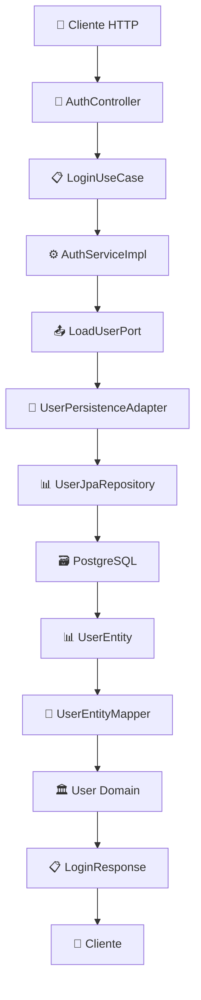

# 🏛️ Auth Service - Microservicio de Autenticación con Arquitectura Hexagonal

## 📖 Descripción

Microservicio de autenticación desarrollado siguiendo los principios de **Arquitectura Hexagonal (Ports & Adapters)** y **Clean Architecture**.

### 🎯 Características Principales:

- ✅ **Arquitectura Hexagonal completa** - Separación total entre dominio e infraestructura
- ✅ **Clean Architecture** - Capas bien definidas con inversión de dependencias
- ✅ **Casos de uso granulares** - `LoginUseCase` específico y testeable
- ✅ **Persistencia JPA** - Con entidades, repositorios y mappers
- ✅ **Gestión de transacciones** - Configuración automática de Spring
- ✅ **Manejo de excepciones** - GlobalExceptionHandler centralizado
- ✅ **Logging y auditoría** - Trazabilidad completa de operaciones

---

## 🏗️ Arquitectura Hexagonal

### 📐 Estructura del Proyecto

```
src/main/java/com/empresa/auth_service/
├── 🎯 application/                    # NÚCLEO HEXAGONAL
│   ├── port/
│   │   ├── in/                       # Puertos de Entrada
│   │   │   └── LoginUseCase.java     # Contrato del caso de uso
│   │   └── out/                      # Puertos de Salida
│   │       ├── LoadUserPort.java    # Puerto para cargar usuarios
│   │       ├── SaveUserPort.java    # Puerto para guardar usuarios
│   │       └── ...otros puertos...
│   └── service/
│       └── AuthServiceImpl.java     # Implementación del caso de uso
│
├── 🏛️ domain/                        # DOMINIO PURO
│   ├── model/
│   │   └── User.java               # Entidad de dominio
│   └── enums/
│       └── Role.java               # Enumeraciones del dominio
│
├── 🔧 common/                        # ELEMENTOS TRANSVERSALES
│   ├── config/                     # Configuraciones Spring
│   │   ├── DatabaseConfig.java
│   │   ├── SecurityConfig.java
│   │   └── SwaggerConfig.java
│   └── exception/                  # Manejo global de excepciones
│       ├── GlobalExceptionHandler.java
│       ├── InvalidCredentialsException.java
│       └── AccountLockedException.java
│
└── 🔌 infrastructure/                # ADAPTADORES EXTERNOS
    ├── in/                         # Adaptadores de Entrada
    │   └── web/
    │       ├── controller/
    │       │   └── AuthController.java    # REST API Controller
    │       └── dto/
    │           ├── request/
    │           │   └── LoginRequest.java  # DTO de entrada
    │           └── response/
    │               ├── LoginResponse.java # DTO de salida
    │               └── ErrorDTO.java      # DTO de errores
    └── out/                        # Adaptadores de Salida
        └── persistence/
            ├── entity/
            │   └── UserEntity.java       # Entidad JPA
            ├── repository/
            │   └── UserJpaRepository.java # Repository JPA
            ├── mapper/
            │   └── UserEntityMapper.java  # Mapper Entity ↔ Domain
            └── adapter/
                └── UserPersistenceAdapter.java # Implementa puertos
```

### 🔄 Flujo de Datos Hexagonal



---

## ⚙️ Stack Tecnológico

| Capa                | Tecnología      | Versión | Propósito                    |
| ------------------- | --------------- | ------- | ---------------------------- |
| **Framework**       | Spring Boot     | 3.5.4   | Framework principal          |
| **Seguridad**       | Spring Security | 6.x     | Autenticación y autorización |
| **Persistencia**    | Spring Data JPA | 3.x     | ORM y repositorios           |
| **Base de Datos**   | PostgreSQL      | 17.5    | Base de datos relacional     |
| **Pool Conexiones** | HikariCP        | Auto    | Gestión de conexiones        |
| **Mensajería**      | Apache Kafka    | 3.4     | Eventos asíncronos           |
| **Build Tool**      | Maven           | 3.9     | Gestión de dependencias      |
| **Java**            | OpenJDK         | 17 LTS  | Lenguaje y runtime           |
| **Annotations**     | Lombok          | Latest  | Reducción de boilerplate     |

---

---

---

## 🏃‍♂️ Ejecución

### 📋 Prerrequisitos

- ☕ **Java 17** (OpenJDK recomendado)
- 🗃️ **PostgreSQL 17.5+** ejecutándose
- 🔨 **Maven 3.9+**

### 🚀 Pasos para Ejecutar

1. **Clonar el repositorio:**

   ```bash
   git clone https://github.com/EduartDC/auth-service.git
   cd auth-service
   ```

2. **Configurar base de datos:**

   ```bash
   # Crear base de datos en PostgreSQL
   createdb boletosdb

   # Ejecutar script de migración (opcional)
   psql -d boletosdb -f src/main/resources/db/migration/V001__create_users_table.sql
   ```

3. **Compilar el proyecto:**

   ```bash
   mvn clean compile
   ```

4. **Ejecutar tests:**

   ```bash
   mvn test
   ```

5. **Ejecutar la aplicación:**
   ```bash
   mvn spring-boot:run
   ```

## 📚 Principios de Arquitectura Aplicados

### 🎯 Principios SOLID

- ✅ **SRP**: Cada clase tiene una única responsabilidad
- ✅ **OCP**: Abierto para extensión, cerrado para modificación
- ✅ **LSP**: Las implementaciones respetan los contratos
- ✅ **ISP**: Interfaces específicas y cohesivas
- ✅ **DIP**: Dependencia de abstracciones, no concreciones

### 🏛️ Clean Architecture

- ✅ **Independencia de frameworks**: El dominio no conoce Spring
- ✅ **Testeable**: Fácil testing sin infraestructura
- ✅ **Independiente de UI**: Puede cambiar REST por GraphQL
- ✅ **Independiente de BD**: Puede cambiar PostgreSQL por MongoDB
- ✅ **Independiente de agentes externos**: Kafka es opcional

### 🔶 Hexagonal Architecture

- ✅ **Puertos de entrada**: Definen casos de uso
- ✅ **Puertos de salida**: Abstraen infraestructura
- ✅ **Adaptadores**: Implementan detalles técnicos
- ✅ **Núcleo protegido**: Dominio sin dependencias externas

---

## 🔄 Extensibilidad Futura

### � Casos de Uso Planificados

- 📝 `RegisterUseCase` - Registro de usuarios
- 🚪 `LogoutUseCase` - Cierre de sesión
- 🔄 `RefreshTokenUseCase` - Renovación de tokens
- 🔒 `ResetPasswordUseCase` - Recuperación de contraseña

---

## 📄 Licencia

Este proyecto está bajo la Licencia MIT - ver el archivo [LICENSE](LICENSE) para detalles.

---

## � Contacto

**Desarrollador:** Eduardo DC  
**Email:** eduar.dc@empresa.com  
**GitHub:** [@EduartDC](https://github.com/EduartDC)

---

_Desarrollado con ❤️ usando Arquitectura Hexagonal y principios de Clean Architecture_
